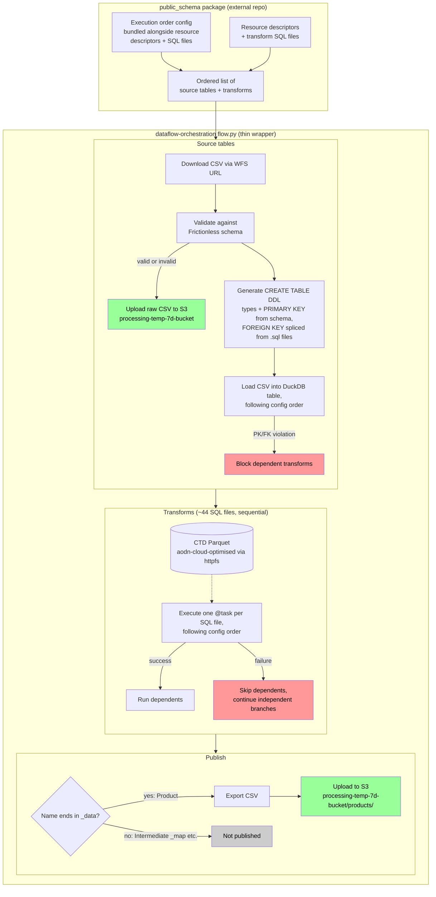

# Architecture — water_sampling_db ETL flow

This diagram shows the planned end-to-end pipeline design (Phase 3, not yet implemented — see
`docs/adr/` in this directory and `CONTEXT.md` for the underlying decisions). Following ADR-0004,
almost all pipeline logic below lives in the external `public_schema` package; this repo's
`flow.py` is a thin Prefect wrapper that calls `public_schema`'s API and wraps each step in a
`@task` for observability, retries, and the "block dependents" failure policy.

## Notes

- Reflects [ADR-0004](./docs/adr/0004-flow-logic-packaged-in-public-schema.md) (most pipeline
  logic lives in `public_schema`, this repo holds only a thin wrapper flow),
  [ADR-0005](./docs/adr/0005-execution-order-via-config-file.md) (execution order comes from an
  explicit config file, superseding the dependency-graph approach in
  [ADR-0001](./docs/adr/0001-execution-order-via-unified-dependency-graph.md)),
  [ADR-0002](./docs/adr/0002-pk-fk-constraints-via-create-table-ddl.md) (PK/FK enforced via
  generated `CREATE TABLE` DDL), and [ADR-0003](./docs/adr/0003-ephemeral-duckdb-per-run.md)
  (DuckDB rebuilt fresh every run).
- Domain terms (Resource, Source table, Transform, Product, Intermediate table) are defined in
  [CONTEXT.md](./CONTEXT.md).
- `SKIP1`/`SKIP2` (red) both apply the same "block dependents" failure policy, whether the failure
  originates from a Frictionless validation error, a PK/FK constraint violation, or a transform SQL
  error — "dependents" here is read directly from the config order, not derived.
- The box boundary between `public_schema` and the wrapper flow is illustrative of *where the logic
  lives*, not a strict runtime process boundary — `public_schema` is imported as a library by the
  Prefect flow, not run as a separate service.
