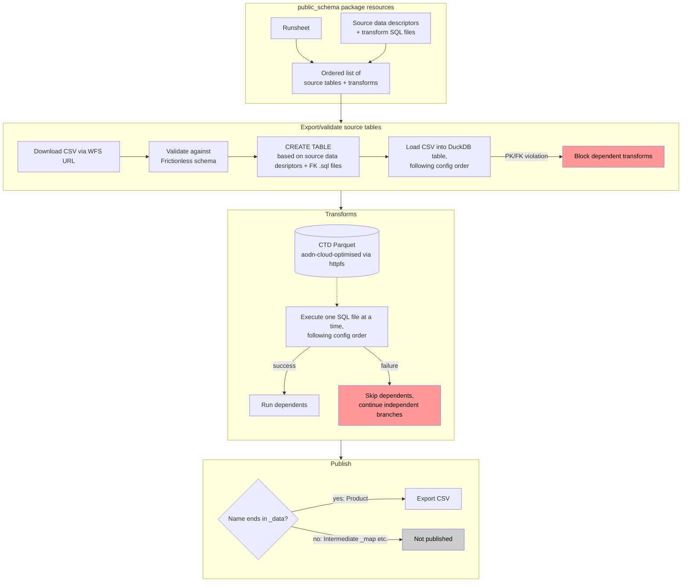

# Architecture — water_sampling_db ETL flow

End-to-end pipeline design (not yet implemented past Export/Validate — see
[`water_sampling_db.md`](./water_sampling_db.md) and [`docs/adr/`](./adr/) for the decisions
behind it). Per [ADR-0004](./adr/0004-flow-logic-packaged-in-public-schema.md), this package (`public_schema`) implements
most of the pipeline logic. Orchestration and deployment to AODN's infrastructure
is handled elsewhere, using Prefect to handle scheduling, observability, retries, 
and uploading products to S3.

## Notes

- Reflects [ADR-0004](./adr/0004-flow-logic-packaged-in-public-schema.md) (pipeline logic lives in
  this package; the other repo holds only a thin wrapper flow),
  [ADR-0005](./adr/0005-execution-order-via-config-file.md) (execution order comes from an
  explicit config file, superseding the dependency-graph approach in
  [ADR-0001](./adr/0001-execution-order-via-unified-dependency-graph.md)),
  [ADR-0002](./adr/0002-pk-fk-constraints-via-create-table-ddl.md) (PK/FK enforced via generated
  `CREATE TABLE` DDL), and [ADR-0003](./adr/0003-ephemeral-duckdb-per-run.md) (DuckDB rebuilt fresh
  every run).
- Domain terms (Resource, Source table, Transform, Product, Intermediate table) are defined in
  [`CONTEXT.md`](../CONTEXT.md).
- `SKIP1`/`SKIP2` (red) both apply the same "block dependents" failure policy, whether the failure
  originates from a Frictionless validation error, a PK/FK constraint violation, or a transform SQL
  error — "dependents" here is read directly from the config order, not derived.
- This package exposes plain Python functions (e.g. `load_source_tables`, `run_transforms`) with no
  Prefect dependency; the wrapper flow imports it as a library and owns all S3/Prefect concerns.
